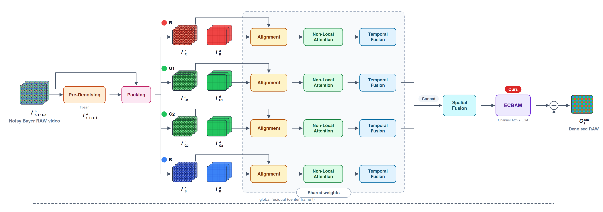

# ELRVD: Extreme Low-light RAW Video Denoising with RViDeNet-ECBAM

This repository contains the inference and visualization code for a capstone project on **extreme low-light RAW video denoising**. The core model is **RViDeNet-ECBAM**, a modified [RViDeNet](https://github.com/cao-cong/RViDeNet) that replaces the CBAM attention block with ECBAM (channel attention + Enhanced Spatial Attention) to better separate globally distributed low-light noise from real structure.

The model takes 3 consecutive noisy Bayer RAW frames and outputs a denoised RAW frame for the center frame, using temporal information from neighboring frames:

```text
noisy Bayer RAW frames -> RViDeNet-ECBAM inference -> denoised RAW frames -> debayer PNG -> MP4 visualization
```

## Architecture



A frozen pre-denoising module guides deformable alignment offsets; the input is packed into 4 Bayer sub-frames (R/G1/G2/B) that go through shared-weight Alignment → Non-Local Attention → Temporal Fusion paths, followed by Spatial Fusion, the **ECBAM** attention block (our modification: channel attention + ESA), and a global residual connection to produce the denoised RAW frame.

## Highlights

- **RAW-domain video denoising**: trained primarily with RAW reconstruction and temporal consistency losses, plus an auxiliary sRGB-domain loss (weight 0.5) computed through a frozen pretrained ISP module.
- **ECBAM attention**: CBAM's 7×7 spatial attention is replaced with ESA (strided conv + max-pooling downsampling, then bilinear upsampling), greatly enlarging the effective receptive field. This helps distinguish flat noisy regions from structures when noise covers the whole frame.
- **Sequential fine-tuning**: synthetic pretraining (MOTChallenge unprocessed to RAW + Poisson-Gaussian noise) → CRVD fine-tuning (GBRG) → fine-tuning on a self-captured 0.1 lux IMX327 RAW dataset (RGGB).
- **Full-resolution tiled inference**: a new tile-based inference pipeline (256×256 patches with overlap) supports arbitrary full-resolution RAW input, unlike the original CRVD evaluation script.

### Changes vs. original RViDeNet

| | Original RViDeNet | This project (RViDeNet-ECBAM) |
|---|---|---|
| Attention block | CBAM (channel + 7×7 conv spatial attention) | ECBAM (channel attention + ESA) |
| Spatial attention receptive field | Limited to 7×7 kernel | Greatly enlarged via strided conv + max-pooling downsampling |
| Bayer packing | GBRG (CRVD) | GBRG + RGGB (IMX327) |
| Synthetic noise model | Poisson + Gaussian | Poisson + Gaussian + row noise + quantization noise |
| Fine-tuning LR | Single LR | Layer-wise LR (backbone 1e-6 / recon trunk, ECBAM, output conv 1e-5) |
| Inference | CRVD evaluation script | Full-resolution tiled inference pipeline |

## Results (summary)

Evaluated on a self-captured 0.1 lux IMX327 RAW validation set and ReCRVD (external generalization set), against the noisy input, VBM3D, and FastDVDNet baselines.

| Dataset | Metric (RAW) | Noisy | RViDeNet-ECBAM |
|---|---|---|---|
| Self-captured 0.1 lux | PSNR / SSIM | 45.03 / 0.954 | **57.06 / 0.996** |
| ReCRVD | PSNR / SSIM | 21.81 / 0.693 | **39.33 / 0.978** |

- On the self-captured set (PNG domain), RViDeNet-ECBAM achieves the best PSNR/SSIM/tOF among all compared methods.
- On ReCRVD, it achieves the best LPIPS (perceptual quality) of all methods.
- In a YOLOv11x downstream proxy evaluation on the 0.1 lux set, detections per frame go from 0.016 (noisy) to 1.64, and detected-frame ratio from 0.016 to 0.726 — the strongest downstream result of all compared methods.
- A known limitation is over-smoothing of fine texture; alpha blending of the output with the noisy input (`I = α·denoised + (1−α)·noisy`) can trade noise removal against texture preservation.

## Repository Structure

```text
inference.py                  # main inference entry point (tiled full-resolution RAW inference)
raw_to_debayer_png.py         # RAW Bayer -> PNG visualization helper
models.py                     # RViDeNet / RViDeNet-ECBAM model definitions
models_util.py                # building blocks shared by models.py
utils.py                      # tiled inference and utility functions
modules/cbam.py               # CBAM and ECBAM (ESA) attention blocks
modules/DCNv2_latest/         # DCNv2 CUDA extension source (deformable alignment)
inference/models/             # bundled inference checkpoints
scripts/                      # batch inference, visualization, and video conversion scripts
docs/                         # data format and usage notes
```

## Environment Setup

> **Requires Linux with an NVIDIA CUDA GPU.** Inference and the DCNv2 extension are CUDA-only; see [SETUP.md](SETUP.md) for details.

```bash
conda env create -f environment.yaml
conda activate ELRVD
```

Build DCNv2 after activating the environment:

```bash
cd modules/DCNv2_latest
bash make.sh
cd ../..
```

See [SETUP.md](SETUP.md) for details.

## Checkpoints

Expected checkpoint paths:

```text
inference/models/denoiser/model_epoch500.pth   # RViDeNet-ECBAM denoiser (used by inference.py)
inference/models/isp/model_epoch770.pth        # frozen ISP module (training only; not used by inference.py)
```

`inference.py` only loads the denoiser. PNG visualization during inference uses a Debayer5x5 + linear gain pipeline, not the learned ISP. The ISP checkpoint is bundled because the training scripts use it as a frozen module for the sRGB-domain loss.

You can override the denoiser checkpoint path:

```bash
python inference.py --model_path /path/to/model_epoch500.pth ...
```

## Data Format

Input RAW frames are expected as 16-bit Bayer RAW files. The frame size, black level, white level, and Bayer layout must match the dataset (e.g. IMX327: 1920×1080, black level 240, white level 4095, RGGB).

### Input requirements and limitations

The tiled pipeline handles arbitrary resolutions, but the following constraints apply:

- **16-bit single-channel Bayer RAW only.** Frames are read as raw `uint16` (`height × width`). Already-demosaiced RGB, 8-bit, or container formats (DNG/TIFF) are not supported — pass the planar Bayer data directly.
- **RGGB Bayer layout only.** The model packs input as RGGB and was fine-tuned on an RGGB (IMX327) sensor. The `--debayer_layout` argument only affects PNG *visualization*, **not** the model input packing, so non-RGGB sensors (GBRG/BGGR/GRBG) will not be denoised correctly without re-packing.
- **Even height and width.** Bayer packing splits the frame into 2×2 color planes, so odd dimensions are not supported (true for essentially all Bayer sensors).
- **Minimum size depends on `--patch_size`.** Tiling operates on the packed (half-resolution) frame, so with the default `--patch_size 256` the input RAW must be at least ~512×512. For smaller frames, reduce `--patch_size` accordingly.
- **Correct `--black_level` / `--white_level` / `--height` / `--width` are required.** These are not read from the file; a mismatch produces wrong normalization or a reshape error.

Example noisy input structure:

```text
ELRVD_raw/
  scene3_snake/
    noisy/
      noisy_frame_00000.raw
      noisy_frame_00001.raw
```

See [docs/data_format.md](docs/data_format.md).

## Inference

Single command example:

```bash
python inference.py   --input_dir /path/to/scene/noisy   --output_dir /path/to/scene/rvidenet   --height 1080   --width 1920   --black_level 240   --white_level 4095   --gpu_id 0   --save_rgb False   --vis_data False
```

Batch scripts are available under `scripts/`.

```bash
INPUT_ROOT=/path/to/ELRVD_raw GPU_ID=0 scripts/run_elrvd_rvidenet_inference.sh
INPUT_ROOT=/path/to/ReCRVD_raw GPU_ID=1 scripts/run_recrvd_rvidenet_inference.sh
```

## Visualization

Convert denoised RAW frames to PNG:

```bash
python raw_to_debayer_png.py   --input_dir /path/to/scene/rvidenet   --output_dir /path/to/scene_png/rvidenet   --height 1080   --width 1920   --black_level 240   --white_level 4095   --gain 3.0   --debayer_layout RGGB   --output_name_format frame
```

Convert PNG frames to MP4:

```bash
scripts/png_to_mp4.sh   --png_dir /path/to/png_frames   --output_mp4 /path/to/output.mp4   --fps 10
```

## Training

Training code is **not** released in this repository. The final fine-tuning
stage relies on a self-built extreme-low-light RAW dataset that is the lab's
private, non-public dataset, so the training scripts and the associated data
pipeline are withheld. This repository therefore focuses on inference and
visualization with the released checkpoint.

For reference, the model was trained with a 3-stage strategy:

1. **Pre-denoising module pretraining** — synthetic noisy-clean pairs from SID clean RAW images; the module is frozen afterwards and used only to guide deformable alignment offsets.
2. **RViDeNet pretraining** — synthetic RAW video from MOTChallenge sRGB videos (unprocessing + Poisson-Gaussian noise), RAW reconstruction loss only.
3. **Sequential fine-tuning** — CRVD (GBRG) first, then the self-captured 0.1 lux IMX327 dataset (RGGB), with a layer-wise learning rate (backbone 1e-6 / recon trunk, attention, output conv 1e-5) and a loss combining RAW reconstruction, temporal consistency, and an auxiliary sRGB term.

## Datasets

| Dataset | Role | Notes |
|---|---|---|
| [CRVD](https://github.com/cao-cong/RViDeNet) | Fine-tuning (stage 3-1) | 11 indoor scenes × 5 ISO levels, GBRG |
| Self-captured ELRVD RAW *(private, not released)* | Fine-tuning + validation (stage 3-2) | 0.1 lux, 12 scenes × 60 frames, IMX327 RGGB, GT = ~100-shot average; lab-built dataset, not publicly available |
| [ReCRVD](https://github.com/cao-cong/RViDeformer) | External evaluation | 120 scenes, generalization test |

## Acknowledgements

This project builds on:

- [RViDeNet](https://github.com/cao-cong/RViDeNet) (Yue et al., "Supervised Raw Video Denoising with a Benchmark Dataset on Dynamic Scenes", CVPR 2020) — base architecture and CRVD dataset
- [ReCRVD / RViDeformer](https://github.com/cao-cong/RViDeformer) (Yue et al.) — external evaluation dataset
- [FastDVDNet](https://github.com/m-tassano/fastdvdnet) and VBM3D — comparison baselines
- [DCNv2](modules/DCNv2_latest/) — deformable convolution CUDA extension

Please cite or acknowledge the original works when using this repository.
